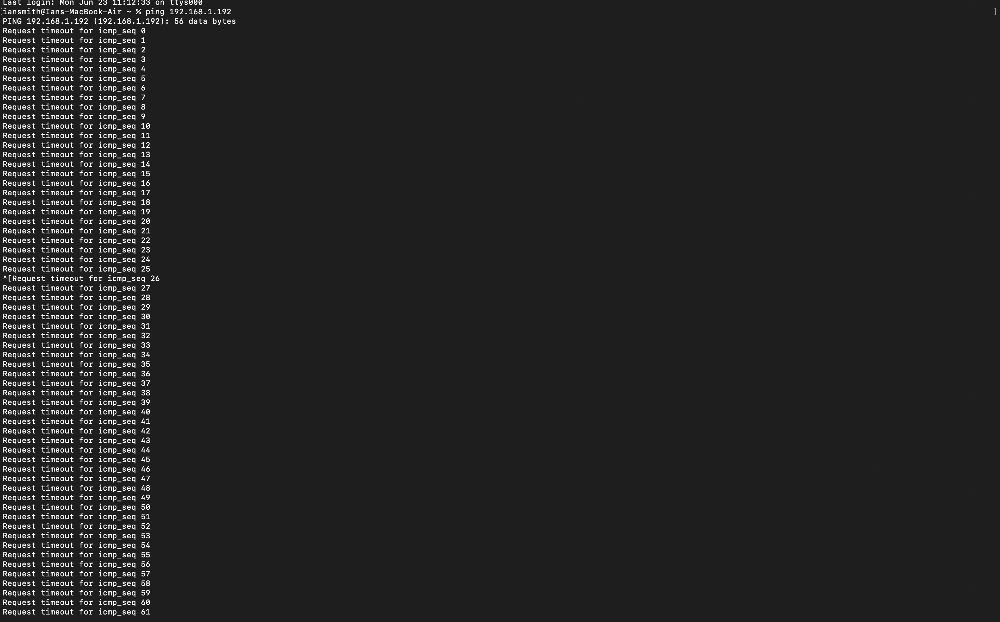

# 🔥 Windows Firewall Project – Security+ Practice Lab

This beginner-friendly cybersecurity project simulates host-based firewall hardening using **Windows Defender Firewall** on Windows 10. It includes creating and testing custom outbound and inbound rules with real-world relevance to entry-level IT and cybersecurity roles.

---

## 🧠 Project Goals

- Create a custom **outbound rule** to block Google Chrome from accessing the internet
- Create an **inbound rule** to block ICMP (ping) requests
- Test and verify both rules
- Document everything as if working in a junior IT or SOC role

---

## 🛠️ Tools Used

- Windows 10 Pro (Local Machine)
- Windows Defender Firewall
- MacBook (used to simulate ping requests)
- Command Prompt

---

## 📸 Screenshots

### 1. Firewall Main Console

### 2. Block Chrome – Rule Setup

### 3. Chrome Cannot Connect (Test Result)

### 4. ICMP Rule Configuration

### 5. Ping Test from Another Device

---

## 🧪 Testing & Results

✅ **Outbound Rule**: Chrome could not load any websites after applying the rule  
✅ **Inbound Rule**: Ping requests from another device timed out (firewall silently dropped them)

---

## 🧑‍💻 Real-World Use Case

These kinds of rules are common in:
- Help Desk & Desktop Support roles (blocking unauthorized apps)
- Cybersecurity teams (reducing attack surface)
- Network Admins (enforcing policy compliance)
- SOC Analysts (hardening endpoints in high-risk environments)

---

## 📚 Reflections

This project gave me hands-on experience with local firewalls, one of the most overlooked but critical layers of defense. While simple, these rules reflect **real work tasks** in endpoint security and system hardening.

---

## 📎 More Projects Coming Soon

Stay tuned — more Security+ and cloud-related projects will be added to this repo and my full portfolio.

